---

## Languages

## Concepts & Paradigms

`Unix programming` · `multithreading` · `concurrency` · `memory management` ·
`OOP` · `design patterns` · `algorithms & data structures` · `networking` ·
`sockets` · `RESTful APIs` · `debugging` · `system design`

## Tools

## Web & Networking

`HTTP` · `web server architecture` · `client-server model` · `TCP/IP` ·
`subnetting` · `TLS` · `containerized services` · `Linux system administration`

## Cloud & Security

> Currently studying for cloud certifications — learning cloud
> infrastructure (AWS) and cybersecurity fundamentals.

`cloud computing (in progress)` · `network security (in progress)` · `virtualization` · `CI/CD basics`

---

## Stats

## Contact

